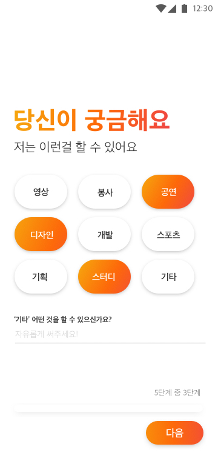
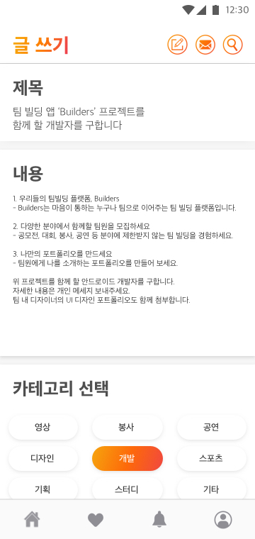
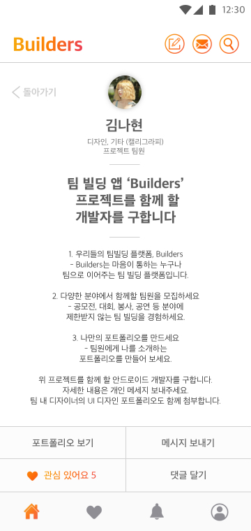
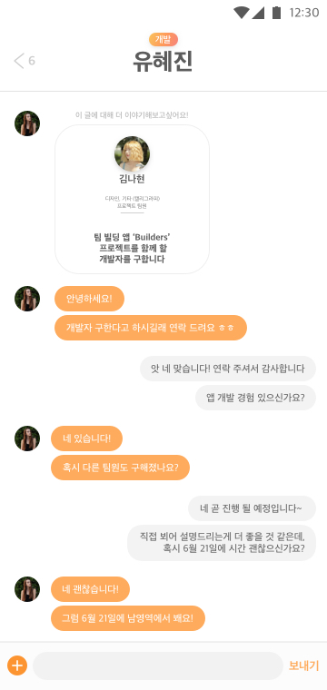

# Builders

Builders - 우리들의 팀빌딩 플랫폼

## 프로젝트 소개

빌더즈(Builders)는 학력, 나이에 상관없이 누구나 대회, 공모전, 버스킹 등의 다양하고 폭넓은 분야에서 함께할 사람을 모집하고, 마음이 맞는 사람과 여러 유익한 경험을 쌓을 수 있도록 도와주는 개방적인 팀 빌딩 어플리케이션입니다.

## 개발 일정

- 2019 모바일 콘텐츠 개발대회, Team **BuildError** (2019/6/9 ~ 7/16)

## 수상 실적

- 2019  모바일 콘텐츠 개발대회 **동상**

## 만든 사람들

- Project Manager, 황두영
- Android Developer, 정찬효
- Backend Developer, 김도영
- UI Designer, 신나영

## 스크린샷

